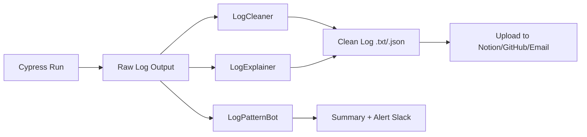
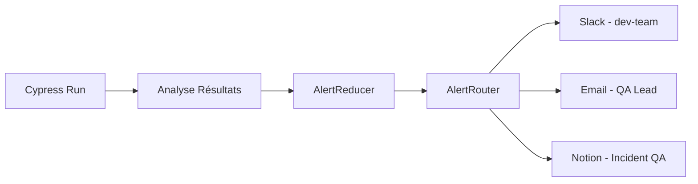

# Guide des Agents IA pour Cypress - Solutions et Problèmes

Ce document présente un **tableau complet** des problèmes fréquemment rencontrés lors des tests Cypress **et des solutions apportées par un agent IA** (avec pitch et description pour chaque cas). Idéal si tu construis une suite d'agents IA spécialisés autour du **cycle de vie des tests E2E**.

## 🧠 Tableau : Problèmes Cypress ↔ Solutions par Agent IA

| 🧪 Problème rencontrés en Cypress | 🤖 Solution par Agent IA | 🎯 Pitch de l'agent IA | 📝 Description détaillée |
|---|---|---|---|
| **1. Écriture manuelle et lente des tests** | Génération automatique de tests à partir d'une spec produit | **Spec2Test** : transforme des specs en tests Cypress | L'agent prend en entrée une spécification utilisateur (Jira, Notion, texte libre) et génère un test Cypress prêt à l'emploi. |
| **2. Tests instables/flaky** | Détection automatique de flakiness et correction des patterns fragiles | **FlakyFixer** : stabilise les tests automatiquement | L'agent détecte les erreurs intermittentes (timeouts, race conditions) et propose des solutions (ex : `cy.waitUntil`, `retry`, ajout de `should`, etc.). |
| **3. Tests cassés à cause d'un changement de sélecteurs** | Mise à jour automatique des sélecteurs grâce au DOM et à Git diff | **SelectorHealer** : corrige les sélecteurs cassés | Compare les anciennes et nouvelles versions de DOM/HTML pour retrouver l'élément cible et mettre à jour les sélecteurs automatiquement. |
| **4. Trop de duplication entre les tests** | Regroupe les tests similaires et factorise les étapes | **TestOptimizer** : nettoie et refactore les specs | Identifie les répétitions dans les specs et extrait des commandes personnalisées (`cy.command`) ou des fonctions réutilisables. |
| **5. Longueur des suites de test** | Sélection intelligente des tests pertinents à exécuter | **SmartRunner** : priorise les tests selon l'impact | Utilise les changements dans le code (`git diff`) pour ne lancer que les tests impactés. Peut intégrer la logique de test ciblé (Test Impact Analysis). |
| **6. Difficulté à comprendre l'erreur** | Génération automatique de résumés d'erreurs en langage naturel | **ExplainBot** : décrypte les erreurs Cypress | Résume les erreurs de test en français ou anglais simple, avec hypothèse de cause et actions recommandées. |
| **7. Résultats de test éparpillés** | Regroupe, résume et notifie les résultats intelligemment | **TestReporter** : dashboard + alertes intelligentes | Regroupe les résultats de test dans un tableau (Notion, Slack, email), les résume, et suggère des actions aux testeurs ou devs. |
| **8. Pas de lien entre tickets produit et tests** | Liaison automatique entre tickets (Jira, Linear) et fichiers de test | **TraceLinker** : connecte les specs aux tests | Génère un lien bidirectionnel entre un ticket et son test Cypress généré ou mis à jour. Idéal pour la traçabilité et l'audit. |
| **9. Maintenance lourde du code de test** | Refactoring intelligent et automatisé du code Cypress | **TestRefactorer** : maintient le code propre | Identifie les mauvaises pratiques, code redondant ou obsolète, et propose une version optimisée du test. |
| **10. Temps perdu à écrire des assertions** | Génère automatiquement les assertions selon le comportement attendu | **AssertGenie** : devine les assertions pertinentes | À partir de la spec ou du comportement observé, propose des assertions robustes (`should`, `contains`, etc.). |
| **11. Difficile de créer un mock ou stub d'API** | Génération intelligente de mock API avec fixtures réalistes | **MockMaster** : crée des stubs d'API dynamiquement | Génère les réponses API attendues (fixtures) en analysant les appels réseau réels ou la documentation Swagger. |
| **12. Manque de test visuel ou UX** | Ajout automatique de tests visuels (snapshot, layout) | **VisualWatch** : surveille les régressions UI | Génère des tests visuels avec `cy.screenshot()` ou intègre Percy ou Applitools de façon intelligente. |
| **13. Tests non maintenus à jour** | Vérifie régulièrement la validité des tests existants | **HealthCheckBot** : surveille et alerte | Passe en revue les tests Cypress chaque semaine, détecte les tests obsolètes ou jamais exécutés. |
| **14. Difficulté d'onboarding QA/Dev** | Génère documentation, tutoriels et exemples à partir du repo | **DocuBot** : rend les tests Cypress compréhensibles | Documente automatiquement chaque test et explique son objectif à un non-spécialiste. |
| **15. Difficile de convertir un test Playwright ↔ Cypress** | Traduction entre frameworks E2E | **CrossTestBot** : convertit les tests entre Cypress/Playwright | Convertit un test écrit en Cypress vers Playwright ou inversement, pour permettre la migration ou la compatibilité. |

### 💡 Tu peux combiner ces agents dans un **pipeline intelligent de QA as Code** :

- `Spec2Test → SelectorHealer → FlakyFixer → TestReporter`
- Chaque agent IA travaille en tâche de fond (Make/n8n, webhook GitHub, cron, etc.)

---

## 📊 Tableau : Problèmes de reporting Cypress ↔ Agents IA reporters

| 🧪 Problème de reporting | 🤖 Solution par Agent IA | 🎯 Pitch de l'agent IA | 📝 Description détaillée |
|---|---|---|---|
| **1. Résultats trop bruts à lire dans le terminal** | Résumé en langage naturel des tests passés/échoués | **SummaryBot** : raconte ce qu'il s'est passé | Cet agent analyse les logs de Cypress (`stdout`, JSON ou JUnit) et produit un résumé lisible par un humain : "8 tests passés, 2 échoués. Login.test.js échoue à cause d'un mauvais sélecteur". |
| **2. Impossible de comprendre rapidement les causes d'échec** | Diagnostic automatique des erreurs | **ExplainBot** : décrypte les erreurs | Fournit pour chaque test échoué une explication claire : "Le bouton 'Se connecter' n'a pas été trouvé. Peut-être un changement de sélecteur ou un chargement trop lent." |
| **3. Difficulté à prioriser les erreurs critiques** | Scoring de sévérité des bugs de test | **BugRanker** : classe les erreurs par urgence | Utilise un scoring IA (basé sur test critique, fonctionnalité vitale, fréquence de l'échec) pour prioriser les bugs signalés. |
| **4. Résultats dispersés (CI, local, Slack, mails...)** | Centralisation et visualisation intelligente des résultats | **TestReporter** : dashboard et alertes intelligentes | Agrège les résultats dans Notion, Linear, Slack ou Email. Génère un tableau quotidien ou hebdo + graphiques si besoin. |
| **5. Personne ne consulte les rapports** | Envoi automatisé et résumé personnalisé selon rôle | **AutoBroadcaster** : envoie la bonne info à la bonne personne | Crée des rapports adaptés au destinataire : dev = détails techniques ; PO = résumé clair ; manager = statut global. |
| **6. Tests échoués non liés à des tickets** | Création auto de tickets Jira/Linear à partir de l'erreur | **IssueBot** : ouvre les tickets à ta place | Génère un ticket avec la description du bug, le test Cypress concerné, la stack trace, une capture d'écran, et un lien vers la CI. |
| **7. Pas de vision historique de la stabilité** | Historique des tests et stabilité par fichier ou feature | **HistoryAnalyzer** : suit la santé des tests | Analyse sur plusieurs exécutions la fréquence des échecs, détecte les tests flaky, suggère des améliorations. |
| **8. Absence de capture d'écran et vidéos bien organisées** | Indexation intelligente des assets de test | **AssetIndexer** : trie les screenshots/vidéos | Organise et nomme les fichiers (`screenshots/2025-06-03/login_fail.png`), les lie au test concerné et aux logs. |
| **9. Manque de métriques business dans les rapports QA** | Ajoute des insights produit / business dans le rapport | **InsightBot** : mixe QA + Produit | Par exemple : "Les tests checkout échouent souvent. Or 75% du trafic passe par cette feature." Il relie les données QA à l'impact business. |
| **10. Trop de messages de test dans Slack/Email** | Résume et filtre les alertes intelligemment | **NoiseReducer** : coupe le bruit, garde l'essentiel | Ne notifie que les échecs critiques. Regroupe les autres dans un récapitulatif silencieux (digest Slack/email quotidien). |

### 💡 Architecture type : Pipeline de reporting IA

```
Cypress Run
   ↓
Raw Logs (.json, .xml, stdout)
   ↓
🧠 Agents IA :
   - SummaryBot (résumé global)
   - ExplainBot (erreurs détaillées)
   - IssueBot (tickets Jira)
   - TestReporter (Slack/Notion)
   - BugRanker (priorisation)
   - HistoryAnalyzer (stabilité)

   ↓
Notion / Slack / Linear / Email / Grafana / GitHub PR Comments
```

---

## 🪵 Tableau : Problèmes de gestion des logs Cypress ↔ Agents IA gestionnaires de logs

| 🧪 Problème de logs Cypress | 🤖 Solution par Agent IA | 🎯 Pitch de l'agent IA | 📝 Description détaillée |
|---|---|---|---|
| **1. Logs trop verbeux ou bruyants** | Filtrage intelligent des logs | **LogCleaner** : nettoie le bruit | Supprime ou masque les lignes inutiles (ex. "XHR completed", "visited URL...") et garde uniquement les lignes liées aux erreurs ou actions clés. |
| **2. Logs peu lisibles pour les non-devs** | Reformulation en langage naturel | **LogExplainer** : rend les logs humains | Reformule les logs techniques en phrases compréhensibles : "L'étape de connexion a échoué car le champ mot de passe était vide." |
| **3. Logs non centralisés** | Regroupement multi-source dans une base unique | **LogAggregator** : regroupe tous les logs en un point | Centralise les logs Cypress issus du terminal, des fichiers `.log`, de la CI ou d'autres sources dans Notion, Elasticsearch, ou une base dédiée. |
| **4. Difficulté à retrouver un log précis** | Indexation et recherche intelligente dans les logs | **LogFinder** : Google des logs de tests | Permet de rechercher par mot-clé, ID de test, timestamp, nom de fichier ou nom de scénario (même en langage naturel) pour trouver un log précis. |
| **5. Pas de lien entre logs et captures d'écran** | Liaison intelligente logs/screenshots/vidéos | **LogLinker** : connecte logs et assets visuels | Associe automatiquement chaque log à sa capture et à la vidéo du test, avec des ancres ou liens dans Notion/Slack. |
| **6. Difficulté à détecter des patterns d'échecs** | Détection automatique de patterns de logs récurrents | **LogPatternBot** : détecte les erreurs fréquentes | Utilise un modèle NLP pour repérer que certaines erreurs se répètent (ex. "Cannot read property 'foo' of undefined") et les regroupe par catégorie. |
| **7. Pas de résumé global des logs** | Résumé automatique des logs de toute la suite | **LogSummarizer** : l'essentiel sans scroller | Résume tous les logs : "4 erreurs critiques sur 8 tests. Les erreurs concernent le login et le panier." |
| **8. Impossible de partager facilement des logs utiles** | Génération de lien ou fichier de log ciblé | **LogSharer** : partage ciblé | Génère un fichier `.txt` ou un lien Notion/Slack/GitHub avec juste la partie utile du log pour un ticket ou une PR. |
| **9. Logs non corrélés aux versions de l'app** | Log contextualisé avec métadonnées | **LogContextualizer** : met les logs dans leur contexte | Ajoute automatiquement au début de chaque log le contexte : commit, version, environnement, date, auteur du test. |
| **10. Logs stockés localement, jamais exploités** | Archivage intelligent et consultable à long terme | **LogArchivist** : historien des logs | Archive les logs dans un format interrogeable avec tagging, horodatage, et historique sur plusieurs runs. |

### 🧠 Exemples concrets de chaînes d'agents IA (Make/n8n)



### 🛠️ Utilisation dans ton pipeline QA automatisé

| Étape | Agent IA | Sortie | Usage |
|---|---|---|---|
| Post-test | `LogCleaner` | Log filtré | À intégrer dans un rapport ou PR |
| Post-test | `LogExplainer` | Log reformulé | À envoyer à un PO ou manager |
| Post-test | `LogPatternBot` | Résumé + alertes | À stocker dans un dashboard historique |
| Post-test | `LogSharer` | Snippet de log | Pour créer un ticket Jira ou Linear clair |

---

## 🚨 Tableau : Problèmes d'alerting Cypress ↔ Agents IA d'alerte

| ⚠️ Problème d'alerting | 🤖 Solution par Agent IA | 🎯 Pitch de l'agent IA | 📝 Description détaillée |
|---|---|---|---|
| **1. Trop d'alertes à chaque run** | Filtrage intelligent et digest unique | **AlertReducer** : alerte uniquement quand c'est pertinent | Ne notifie que si des tests critiques échouent, ou si un seuil est dépassé. Regroupe les alertes non urgentes dans un digest quotidien. |
| **2. Alertes non contextualisées** | Ajout automatique de contexte métier | **ContextBot** : ajoute la couche métier | Enrichit les alertes avec les infos utiles : nom de la feature impactée, responsable, impact business estimé, commit, environnement. |
| **3. Pas de canal adapté selon la sévérité** | Routage intelligent vers le bon canal | **AlertRouter** : envoie au bon endroit, à la bonne personne | Envoie les erreurs critiques sur Slack dev, les alertes mineures par email, et les erreurs produit dans Discord PO. |
| **4. Alertes peu lisibles (log bruts)** | Reformulation claire et synthétique | **AlertWriter** : rédige les messages comme un humain | Reformule les erreurs techniques en langage humain pour Slack/Email/Discord : "Le test de checkout échoue à cause d'un délai de chargement trop long." |
| **5. Impossible de désactiver des alertes récurrentes non critiques** | Détection automatique de bruit ou faux positifs | **NoiseFilter** : apprend ce qu'il faut ignorer | Analyse l'historique et apprend à ignorer les erreurs non bloquantes ou temporaires (flaky). Peut muter certaines alertes automatiquement. |
| **6. Pas de lien vers les ressources utiles** | Ajout automatique de liens (screenshots, vidéos, logs) | **AlertLinker** : enrichit chaque message d'alerte | Ajoute les bons liens (CI run, vidéo, capture, log, PR GitHub) dans l'alerte pour agir plus vite. |
| **7. Pas de résumé global pour l'équipe** | Digest intelligent quotidien ou hebdo | **DailyBriefBot** : le stand-up du matin automatisé | Envoie tous les jours à 9h un résumé Slack/email : "Hier, 14 tests OK, 3 échoués (login, panier). Taux de réussite : 82 %." |
| **8. Aucun suivi des alertes envoyées** | Historique des alertes et analyse de fréquence | **AlertHistorian** : mémoire des incidents QA | Stocke chaque alerte, l'heure, le canal, le type. Permet d'auditer et analyser : quels tests échouent souvent, quelles équipes reçoivent trop d'alertes. |
| **9. Les alertes arrivent en pleine nuit/week-end** | Alerte intelligente en horaires ouvrés | **AlertScheduler** : respecte les horaires de travail | Garde les alertes critiques mais diffère l'envoi des alertes non urgentes aux horaires de bureau (via calendrier ou planning). |
| **10. Aucun feedback humain sur l'alerte** | Interaction dans Slack/Discord pour classer ou résoudre | **AlertAssistant** : slackbot interactif | Permet de marquer une alerte comme "traitée", "à ignorer", ou "ouvrir ticket", directement depuis le message Slack avec des boutons/actions. |

### 📤 Exemples de canaux d'envoi

| Canal | Agent IA recommandé |
|---|---|
| **Slack** | AlertRouter, AlertWriter, AlertAssistant |
| **Discord** | ContextBot, DailyBriefBot |
| **Gmail** | AlertReducer, AlertLinker |
| **Notion / Linear** | AlertHistorian, AlertLinker |
| **SMS / WhatsApp / Telegram** | Pour les incidents critiques via AlertScheduler |

### 🧠 Exemple de workflow intelligent (Make/n8n)



---

## ✅ Bonus : Options de déploiement

Tu peux déployer ces agents via :

- Un **starter GitHub** avec un de ces agents
- Une **intégration Make ou n8n**
- Un **agent GPT personnalisé** pour faire ce reporting à la volée
- Un **template de rapport QA automatisé dans Notion ou PDF**