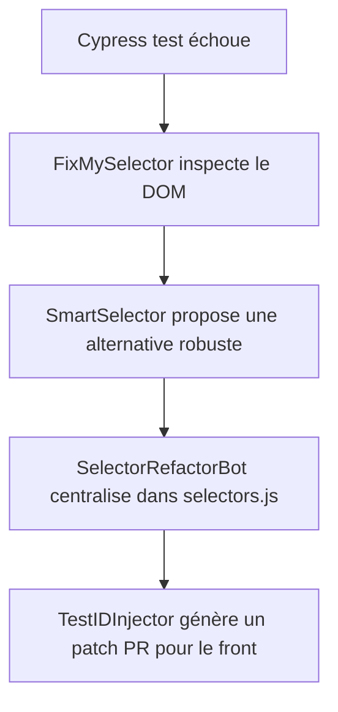

Voici une liste de **sites de démonstration** utiles pour tester Cypress (ou Playwright) – parfaits pour entraîner ou évaluer des agents IA qui gèrent le cycle de vie de tests automatisés :

---

### 🔵 **Sites officiels de démonstration Cypress**

1. **Cypress Real World App (RWA)**

   * 🔗 [https://example.cypress.io](https://example.cypress.io)
   * Code source : [https://github.com/cypress-io/cypress-realworld-app](https://github.com/cypress-io/cypress-realworld-app)
   * ✅ App réaliste (banque, login, transactions, UI riche), idéale pour des tests E2E complets.
   * 🛠️ Backend + frontend en Node.js + React.

2. **Cypress Kitchen Sink** (Exemples de tests Cypress)

   * 🔗 [https://example.cypress.io](https://example.cypress.io)
   * Code source : [https://github.com/cypress-io/cypress-example-kitchensink](https://github.com/cypress-io/cypress-example-kitchensink)
   * ✅ Bon pour débuter avec des exemples variés (formulaires, navigation, etc.)

---

### 🟢 **Sites de test open-source / apps démo généralistes**

3. **Sauce Demo** (e-commerce)

   * 🔗 [https://www.saucedemo.com/](https://www.saucedemo.com/)
   * Login : `standard_user` / `secret_sauce`
   * ✅ Idéal pour tester login, panier, checkout.

4. **Automation Practice (Practice Automation Testing)**

   * 🔗 [https://automationexercise.com/](https://automationexercise.com/)
   * ✅ Gros site e-commerce simulé. Utile pour tests visuels, navigation, recherche, etc.

5. **The Internet – Herokuapp**

   * 🔗 [https://the-internet.herokuapp.com/](https://the-internet.herokuapp.com/)
   * ✅ Nombreux cas de tests classiques : upload, authentification, pop-ups, dynamic content.

6. **Parabank** (Application bancaire simulée)

   * 🔗 [https://parabank.parasoft.com/parabank/index.htm](https://parabank.parasoft.com/parabank/index.htm)
   * ✅ Login, transactions, virement, etc. pour tests bancaires.

---

### 🟡 **Sites de test pour formulaires, UI, login, etc.**

7. **UI Test Automation Playground**

   * 🔗 [https://www.uitestingplayground.com/](https://www.uitestingplayground.com/)
   * ✅ Spécialement conçu pour tester les composants UI dynamiques.

8. **DemoQA**

   * 🔗 [https://demoqa.com/](https://demoqa.com/)
   * ✅ Divers éléments de formulaire, drag and drop, modals, tables dynamiques.

9. **Magento Luma Demo** (E-commerce complexe)

   * 🔗 [https://magento.softwaretestingboard.com/](https://magento.softwaretestingboard.com/)
   * ✅ Test complet d’une boutique avec filtres, panier, checkout.

---

### 🧪 **API + Front pour tests API + UI**

10. **reqres.in**

* 🔗 [https://reqres.in/](https://reqres.in/)
* ✅ REST API simulée + quelques pages front. Bon pour tests API + UI combinés.

---

### Bonus : idées pour créer tes propres démos

* 🛠️ **Mock Service Worker (MSW)** : tu peux créer un faux backend JSON pour des tests.
* 🧪 Utilise des outils comme [Mockoon](https://mockoon.com/) pour simuler rapidement un backend REST.

---

Souhaites-tu que je te prépare :

* Une **base de projet Cypress** prête à l’emploi ?
* Un **workflow n8n/Make** ou **GitHub Actions** pour déclencher les tests ?
* Un **template d’agent IA Spec2Test** qui prend une spec produit ou test-case en entrée et génère un test Cypress ?

Dis-moi ce que tu veux automatiser ou orchestrer dans le cycle de vie.

Voici un tableau détaillé des **problèmes liés aux sélecteurs dans les tests Cypress** et les **agents IA spécialisés que tu pourrais développer pour les résoudre intelligemment**. L'objectif est de couvrir tout le cycle de vie : détection, réparation, suggestion, refactoring et maintenance automatique.

---

### 🧩 Tableau : Problèmes de sélecteurs Cypress ↔ Agents IA de gestion

| ⚠️ Problème                                                              | 🤖 Solution par Agent IA                                 | 🎯 Pitch de l’agent IA                                    | 📝 Description détaillée                                                                                                                        |
| ------------------------------------------------------------------------ | -------------------------------------------------------- | --------------------------------------------------------- | ----------------------------------------------------------------------------------------------------------------------------------------------- |
| **1. Sélecteurs cassés après refacto UI**                                | Détection et remplacement automatique                    | **FixMySelector** : auto-fix des sélecteurs cassés        | Quand un test échoue, l'agent inspecte le DOM, trouve un nouvel identifiant probable et propose/remplace le sélecteur obsolète.                 |
| **2. Mauvais choix de sélecteurs (fragiles, trop dépendants du DOM)**    | Suggestion de sélecteurs robustes (data-\* ou role)      | **SmartSelector** : conseiller de sélecteurs intelligents | Propose les meilleurs sélecteurs au moment de l’écriture des tests : `data-cy`, `aria-label`, `role`, etc., et note leur robustesse.            |
| **3. Duplication de sélecteurs peu maintenables**                        | Centralisation et refacto automatique                    | **SelectorRefactorBot** : DRY ton repo                    | Regroupe tous les sélecteurs dans un fichier commun (`selectors.js`) et remplace les occurences en dur. Crée une couche d’abstraction.          |
| **4. Pas de data-testid en place dans l'app front**                      | Génération automatique des data-\* via IA ou PR suggérée | **TestIDInjector** : assistant pour les devs front        | Propose automatiquement des `data-testid` à injecter dans le code source HTML/JSX à partir des specs produit ou du DOM analysé.                 |
| **5. Sélecteurs qui passent mais pointent sur le mauvais élément**       | Vérification du bon élément (visuel, position, type)     | **SelectorVerifier** : sentinelle du ciblage              | Vérifie que le sélecteur correspond bien à l’élément attendu (type, contenu, visibilité, position), pour éviter les faux positifs.              |
| **6. Incohérence de nommage dans les tests Cypress**                     | Normalisation et linting automatique                     | **SelectorLinter** : le Prettier des sélecteurs           | Analyse tous les sélecteurs de ton repo de tests et impose une convention : kebab-case, data-cy only, pas de `.class` fragile.                  |
| **7. Trop de sélecteurs spécifiques à chaque test (peu réutilisables)**  | Extraction de composants UI récurrents                   | **PatternRecognizer** : détecteur de patterns UI          | Identifie les blocs récurrents (ex : boutons "Valider", "Ajouter au panier") et propose des fonctions réutilisables avec sélecteurs génériques. |
| **8. Sélecteurs conditionnels (affichés dynamiquement)**                 | Anticipation et adaptation automatique                   | **ContextAwareBot** : sélecteurs dynamiques gérés         | Gère les éléments dynamiques en vérifiant le contexte (état UI, modaux ouverts, tab actif), et adapte le sélecteur utilisé à la volée.          |
| **9. Trop de flaky tests à cause de composants en JS qui se rechargent** | Attente intelligente du bon état DOM                     | **WaitMaster** : détecteur de stabilité DOM               | Ajoute des `cy.waitUntil()` ou `cy.intercept()` de façon dynamique si l’élément n’est pas encore stable ou est masqué.                          |
| **10. Sélecteurs inutilisés ou morts**                                   | Nettoyage automatique des sélecteurs obsolètes           | **DeadSelectorHunter** : nettoyeur de déchets DOM         | Scanne tout le code Cypress + DOM de l’app, identifie les sélecteurs jamais utilisés ou jamais trouvés, et propose une PR de suppression.       |

---

### 🔄 Exemple de workflow agent Cypress sélecteurs

---

